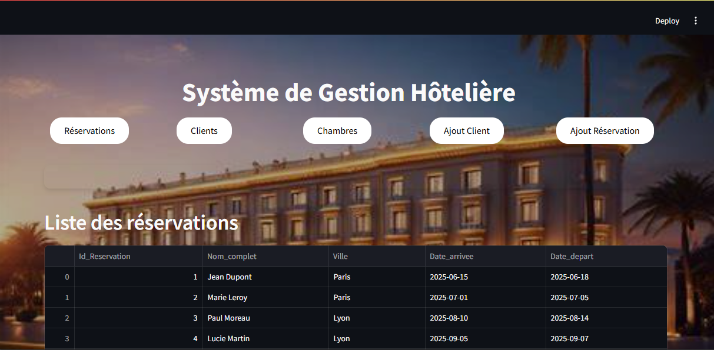

🏨 Système de Gestion Hôtelière

Application web pour gérer les réservations, clients et chambres d'un hôtel.

🚀 Fonctionnalités

 -📅 Gestion des réservations

 -👥 Gestion des clients

 -🛏️ Recherche de chambres disponibles

 -➕ Ajout de nouveaux clients/réservations

 🗃️ Base de Données

 -SQLite (hotel.db)

 -Schéma : Clients, Chambres, Réservations, Évaluations

 📸 Aperçu

 

 📝Auteur(e)

Nom : [Laila Borrou && Aicha Echchafiai]
Projet réalisé dans le cadre de " Base de données "
